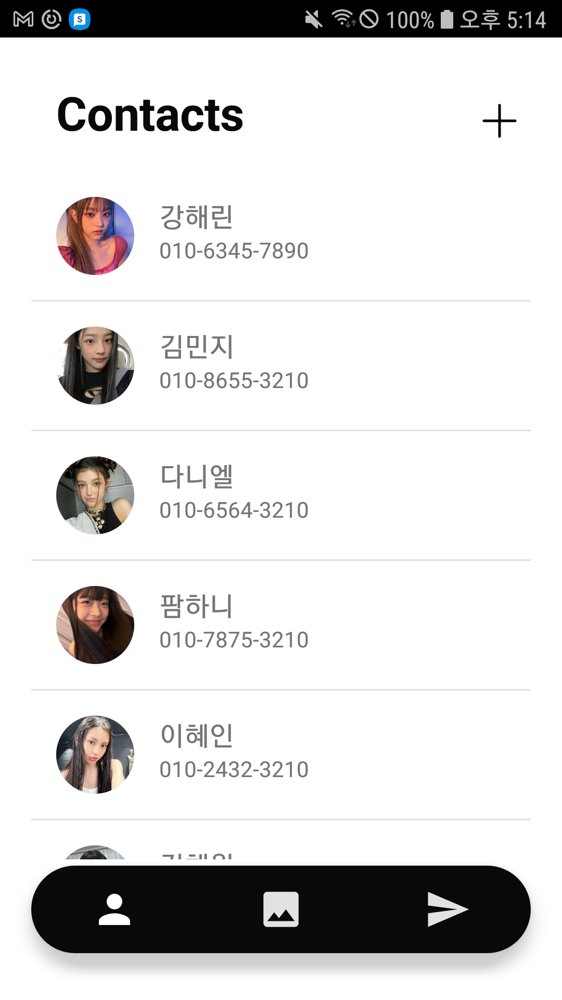

# PolarLettor 프로젝트 (💡 몰입캠프 1주차 과제: 홍성문, 이지안)

## Tab0 : 로딩화면, 앱아이콘, 기본 Activity 화면

뤼튼 Gpt의 이미지 생성 기능을 사용.

기본 Activity 화면 3개를 만들고, 버튼 기능을 이용해 화면전환을 수행한다.

|Contacts|Photos|Google Map|
|--|--|--|
||||

## Tab1 : Contacts

1. 앱 내부에 저장된 json파일의 프로필 사진, 이름, 전화번호를 보여줍니다.

2. 새로운 연락처를 등록합니다.
    - 이름, 연락처는 필수 입력 사항입니다. 이름, 연락처를 입력하지 않을 시 입력을 요청합니다.
    - 프로필 사진을 등록합니다.

|Contacts|Photos|Google Map|
|--|--|--|
||||

|Contacts|Photos|Google Map|
|--|--|--|
||||

## Tab2 : Gallery

1. Photos 이미지 버튼을 클릭하면, 미리보기 느낌의 갤러리가 Fragment로 출력됨
    -이미지 클릭시 팝업화면으로 이미지 확대 가능
2. Add Photos 이미지 버튼을 클릭하면 새로운 갤러리 구축을 위한 Activity화면으로 이동
    -원하는 이미지를 다수 선택해 갤러리 구축 가능.
3. 카메라 촬영후 내부저장소에 저장하는 기능이 있었으나 현재는 삭제

|Contacts|Photos|Google Map|
|--|--|--|
||||

## Tab3 : Send

1. 폴라로이드 느낌의 사진촬영 기능 구현
    -스티커를 선택하게 되면 촬영 시작.
    -촬영후 스티커와 폴라로이드 테두리가 추가된 이미지 파일을 출력함

   

## [미구현] 기능
1.Tab3에서 문자메시지로 이미지를 전송하는 기능->공기계에서 문자 전송이 어렵기도 했고, 시간이 부족했다.

2.Tab2에서 Add Photo 기능을 Fragment 파일로 만들어 주고 싶었으나 Layout과 관련해 오류가 해결되지 않아 Activity로 구현함.

3.Tab1에서 연락처를 옆으로 슬라이드 하면 삭제되는 기능->시간이 부족했다.

## 후기
